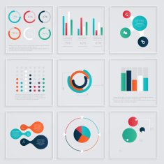
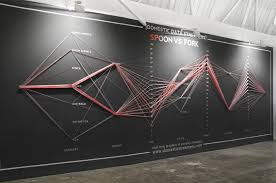

```{r setup, include=FALSE}
library(knitr)
library(rmdformats)

## Global options
options(max.print="75")
opts_chunk$set(echo=FALSE,
	             cache=TRUE,
               prompt=FALSE,
               tidy=TRUE,
               comment=NA,
               message=FALSE,
               warning=FALSE)
opts_knit$set(width=75)
```

# Unit Format

This Unit contains 4 lesson modules: Introduction, The Context of Data, Think Outside the Box, and Applying the Tools. You will learn the history of data visualization, the role of context and emotion in data visualizations, and apply your new perspectives to data relevant to you.

**Unit Learning Objectives:**

Students in this unit will:

1. Learn and understand the often untaught background and history of data visualization.
2. Analyze both the historical and contemporary components that make up "bad" data visualization.
3. Examine the impact of emotion in visualization and how it affects the user.
4. Create data visualizations using data relevant to Cal Poly and their own life.

# Lesson 1: Introduction

## Background

What do you think of when you hear the words **"graph"** and **"data visualization"**?

In the field of statistics, communication is everything. The results we achieve won't mean much if we cannot explain to others what we found!

Communication can take many forms: written reports, presentation slides, talks, you name it!

Today, we will focus on one form of statistical communication: **data visualization**

```{r, echo=FALSE, fig.cap="Do your data visualizations have to look like this? Maybe not now, but you'll get there! [Image Credit](https://pixy.org/2927080/)",fig.show="hold",fig.align="center"}

```

<!-- I think we should talk about what type of visualization we want to highlight here! -->

## A Short History of Data Visualization

Let's start by reading an article that presents some of the main innovations and innovators in early data visualization: <https://towardsdatascience.com/a-short-history-of-data-visualisation-de2f81ed0b23>

While reading this article, think and write down your ideas for the following questions:

1. What does the article describe as some of the earliest types of data visualization? 

2. The article defines the "first" visualizations as visualizations that were created by White people. Can you think of other types of early data visualizations?

3. Who were three of the early "pioneers" of data visualization? What set their styles apart?

4. What did the early "pioneers" of data visualization look like? How many women were there? How many people of color? 

5. What innovation led to the rise of spreadsheets and the ability to generate tables and graphics automatically? Name one cost and benefit of this invention.  

### Early Data Visualizations

While the field of data visualization now may seem very technical and built for the modern era, the above examples show that that is not necessarily the case. In fact, these early visualizations relied entirely upon the ability of the artist to convey a compelling story rather than millions of observations. There are many historical figures who you may not associate with Statistics that have successfully created compelling infographics and visualizations. 

```{r, echo=FALSE, out.width="30%",out.height="10%",fig.cap="W. E. B. Du Bois, the American sociologist, historian, civil rights activist, and ... data visualization practitioner! [Image Credit](https://en.wikipedia.org/wiki/W._E._B._Du_Bois)",fig.show="hold",fig.align="center"}
knitr::include_graphics(c("pic_webdubois.jpeg","web_visualization.jpg"))
```


Read the article below about Du Bois' work and pick your favorite infographic of his. Why does it appeal to you? What story is it telling? What data visualization elements does Du Bois use to communicate this story? 

<https://www.smithsonianmag.com/history/first-time-together-and-color-book-displays-web-du-bois-visionary-infographics-180970826/>

While we have learned that visualizations can be informative and very useful, there is also a bad side to visualizations.

## New Frontiers for Data Visualization

Let's revisit a question from the beginning of this unit: What do you think of when you hear the words **"graph"** and **"data visualization"**?

We have learned a bit more about the possibilities for data visualization and expanding the traditional definitions and formats to include emotion. Can we push the boundaries even further?

Here's a link: <http://dataphys.org/list/>.

While reading the above article, walk through some questions below.

1. Choose 3 visualizations from this list that appealed to you most. Why did they appeal to you? What sets these visualizations apart?

2. What does it mean for a data visualization to be interactive? Find an example in the list of physical data visualizations of an interactive one. Explain how it is interactive and what might set it apart from other "static" visualizations.

```{r, echo=FALSE, fig.cap="An example you'll see of physical data visualization [Image 1 Credit](https://aviz.fr/phys)",fig.show="hold", fig.align='center'}

```

Here's a link: <https://hal.inria.fr/hal-01120152/document>.


## Bad Visualization

You have already learned about some of the features that make data visualization "bad": the diagrams are unclear, the graphs are too cluttered, the formatting and colors are off. In this section, we will explore these areas more and examine **why** certain stylistic choices aren't ideal.

Here's a link: <https://www.data-to-viz.com/caveat/counter_intuitive.html>.

Here's a video:

<iframe width="560" height="315" src="https://www.youtube.com/embed/x-rDVXVwW9s" frameborder="0"allowfullscreen></iframe>

While reading the above article and watching the video, think about the following question:

1. The article and video list examples of ways a data visualization can become counter-intuitive and/or misleading. Can you come up with other ways in which data visualization can be misleading? Work with your partner to brainstorm ideas and look for an example of a bad infographic that exemplifies your chosen aspect.

### Homework 

As data visualization continues to grow as a field, experts set rules for what makes a visualization good or bad, useful or misleading, etc. One contentious aspect of the field is how to incorporate emotion in graphs and visualization work. For homework, please read the article linked below and make notes on what the author regards as the downsides and dangers of incorporating emotion into data visualizations.

Here's a link: <https://businessesgrow.com/2020/08/05/data-is-dangerous/>.

> KEY LESSON TAKEAWAYS: Data visualization as we know it today is not a new phenomenon; 
> it is the culmination and continuation of > years of work and artistry. We have also 
> learned that while data visualization can be a very powerful tool, there are many 
> instances of misuse that we should be wary of.

***

# Lesson 2: The Context of Data

## Let the Numbers Speak For Themselves

<!-- Have a discussion here about the previous article that was homework (article about emotions) -->

Here's the final sentence from the article: "Let the PR peeps do the "spinning" and data do the talking."

Do you think this is a fair assessment?

"Rather than seeing knowledge artifacts - like datasets - as neutral and objective fodder to use for more knowledge making, a feminist perspective advocates for connecting them back to their context, to better understand their limitations and ethical obligations. And, ultimately, to better understand the ways in which power and privilege may be obscuring the truth.” - "Data Feminism" by Catherine D'Ignazio and Lauren Klein

## Numbers Without Context

We have this traditional idea that a (data) scientist should only gather data, analyze it, and then present it in as unbiased a way as possible. This "imagined" objectivity, if you will, means that the information being presented is untainted by emotion and is as close to the truth as possible without allowing for personal biases.

The problem with this thinking, however, assumes that the data is "correct" in the first place; that the data contains all of the information you need to know. Is it possible the data might be wrong?

**Here can we link to the first couple pages or so of the Data Feminism book chapter 5 on the 538 Boko Haram data mishap instead of an article?**

While reading the book excerpt, think and write down your ideas for the following questions:

1. From the initial (inaccurate) data visualization, what do you think would have been some takeaways for the intended audience?

2. What specifically was 538's issue with using GDELT data as their data source?

3. Question 3

When we take our data's accuracy for granted without understanding the context of the numbers we are analyzing, problems such as what 538 experienced arises. At best, it results in a slight reporting mishap; at worst, imagine if this report had been a government report which directly influenced foreign policy! 

Context for data matters, **especially** when you are producing data visualizations. The data visualization like the one from the 538 report seems to be objective and free of emotion. It seems to have a good data source as well. But what is sorely lacking and missing is context; what exactly are each of the many data points in the dataset? What exactly is 538 plotting on their graphs? And for the audience of the visualization, what exactly are they reading and looking at?


Throughout your coursework, you will embark on many data-driven projects and encounter many projects and publications; always aim to understand the original context of the data that is used before you attempt to understand the analysis of that very data. Context is always needed in both data collection and analysis.

Remember the article you read for homework? What about the idea that you, as an author and creator of a data visualization, should not tell your reader what to think, and instead provide "objective" analysis?

1. You have a privilege and a responsibility to communicate both the data and the best interpretation of said data.
2. By not providing more details and context of the data, your audience will tend to fill in the gaps with their own preconceptions and stereotypes.

In this sense, emotion in a data visualization is not a means of persuasion or bias with regards to the audience. Rather, it is your **accurate** framing of the story at hand and your attempt at communicating some sort of analysis of the data.

Knowledge is never absolute; it is always situated in a social, cultural, historical, and material context.

<!-- How can we make this section more interactive for the students? -->
<!-- need to find something for homework for this section, make it connect to the emotion section -->
<!-- maybe a homework assignment could be to create a data biography/user guide??? -->
<!-- something like this: https://weallcount.com/2019/01/21/an-introduction-to-the-data-biography/ -->

> KEY LESSON TAKEAWAYS: Numbers never speak for themselves. After all, data doesn't exist in a vaccum; it is created by many processes and therefore have an underlying context and narrative. In other words, all data you will encounter tells a story, and part of the art of data visualization is understanding that data context and telling the story. As statisticians and data scientists, part of your job as communicators (whether or not it involves a data visualization) is to always understand where your data comes from, what its context is, and how to accurately communicate those analyses.

For "homework," please read the above article and make notes.

> KEY LESSON TAKEAWAYS: Data visualization seems to be in the domain of programming, coding, and online visuals these days; but, we can expand that defintion further. Physical data visualizations have been around since some of the earliest days of human civilization up until the current day. They provide another dimension and way we can explore data.

***

# Lesson 3: Think Outside the Box

What did you learn from the article for "homework"?

Please discuss with your group some of your key takeaways from the article!

## The Power of Emotion

<!-- TODO: Allison will write an initial draft of this! -->

<!-- Section discussing concepts of "stand point" theory and how it relates to emotion in data visualizations!   -->

Eric's notes:
Data visualization is a traditionally "neutral emotional" field where viewers are supposed to be free to respond to the visualization in their own way. Plainness of a visualization/graphic allows greater freedom for the viewer to interpret results for themselves. 

Is visual minimalism really more neutral? Could incorporating emotion into visualization make it better, more interesting, and more valuable for learning and communication?

-> Lead into standpoint theory: we've already established context is important, now draw the connection between context and emotion


```{r, echo=FALSE, fig.cap="The types of emotions your data visualization can bring out! [Image Credit](https://inside.akronchildrens.org/2015/06/24/doctors-share-thoughts-on-the-science-of-inside-out/)",fig.show="hold",fig.align="center"}

```


## Gun Deaths Data

Are data neutral? Can data ever truly be neutral?

Emotion has long been something that is avoided in data visualization work because of the fear that emotion skews the audience perception of the conclusions that can be drawn from the data at hand. In other words, a data visualization should speak for itself and not attempt to influence a reader or viewer in any way.

What do **you** think about this?

Visualization on Years Stolen: <https://www.wired.com/2013/02/periscopic-gun-statistic-visualization/>.

Emotional Storytelling: <https://vizworld.com/2013/09/gun-deaths-infographics-emotional-storytelling/>.

While reading the articles above, walk through the following questions:

1. You have learned previously that the more "cluttered" a data visualization is, the more confusing and unclear it is, and therefore the worse overall it is. In what ways do these articles challenge that?

2. In what ways are data visualizations related to storytelling? Why would these connections be relevant with regards to emotion?

One of the most fascinating aspects of the Periscopic gun data visualization is how it shows all of the data at once while still allowing the user to examine individual points / lives that are being described. By providing *context* to the data, the makers of the data visualization use emotion to tell a real story that brings the whole infographic to life and makes it resonate that much more strongly.


## Evictions Data

In the previous example, you explored how bringing emotion to the graphic can bring out strong feelings and thoughts. Here is another example which, while seemingly messier, still accomplishes similar goals. Think about both the similarities and differences between the previous data visualization and this one.

Anti-Eviction Mapping Project: <http://www.antievictionmappingproject.net/narratives.html>.

While reading the article above, walk through the following questions:

1. In what other ways have you learned previously might this data visualization be considered "messy" or "bad"?

2. How does the Anti-Eviction Mapping Project employ other mediums in their infographic to tell their story?

3. Can you count the number of evictions in this data visualization? If not, does that mean this data visualization is doing its job? Why or why not?

Data visualization allows us to tell stories. Sometimes, those stories consist of numbers and numerical summaries of the data we have collected. Other times however, such as in this case, data visualization serves to prove a point by using emotion and connecting the data back to its real life context (by including interviews in this case).

Here's a link: <https://www.microsoft.com/en-us/research/uploads/prod/2019/08/emotional.pdf>.

Here's another link: <https://www.gapminder.org/dollar-street>.

For "homework," please read the above article in the first link and write a 200-word summary of the material. With the second link, explore the data however you like and come to the next class meeting, ready to tell the story of any one family you "meet."

**THIS ASSIGNMENT CAN BE CHANGED. THE ALTERNATIVE IS BELOW**

For "homework," work with your partner/group to brainstorm and search for other "emotional" datasets. You need not create any initial data viz (although highly encouraged!), but please come ready to present on your dataset and any ideas you have on data vizzes you might be able to create from there.

> KEY LESSON TAKEAWAYS: We have been told that data is neutral, and that emotion has no place in a scientific field like statistics and data visualization. However, there is power in emotion and our ability to tell stories and communicate data with that emotion. We also see the power in learning the stories behind our data and the emotions that come from that.

***

# Lesson 4: Applying the Tools

## Cal Poly Data

You've made it to the end of this unit. One more day!

Today, we will be looking at applying your newfound skills and knowledge. After all, how else will you "learn by doing"?


Where Learn by Doing happens 
[Image Credit](https://keyt.com/news/education/2020/08/26/cal-poly-announces-fall-plans-for-a-safe-reopening/)

Cal Poly Coronavirus Data:

1. Here's a link: <https://coronavirus.calpoly.edu/>.

2. Here's another link: <https://coronavirus.calpoly.edu/dashboard>.

General Cal Poly Data:

1. Here's a link: <https://ir.calpoly.edu/tableau-graphs-and-tables>.

2. Here's another link: <https://content-calpoly-edu.s3.amazonaws.com/ir/1/images/CDS_2019-2020%20Final%203.pdf>.

<!-- quick idea: instead of having a section on Cal Poly COVID data, have this in-class assignment -->
<!-- be to work on a data visualization from the dataset that the students made a data bio for -->
<!-- and then homework is to repeat the whole process but for something relevant in their own lives -->

## Data Visualization in Your Life

Weekend assignment: _________
