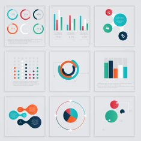
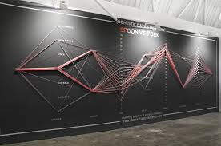

```{r setup, include=FALSE}
library(knitr)
library(rmdformats)

## Global options
options(max.print="75")
opts_chunk$set(echo=FALSE,
	             cache=TRUE,
               prompt=FALSE,
               tidy=TRUE,
               comment=NA,
               message=FALSE,
               warning=FALSE)
opts_knit$set(width=75)
```

# Unit Format

This Unit contains 4 lesson modules: Introduction, The Context of Data, Think Outside the Box, and Applying the Tools. You will learn the history of data visualization, the role of context and emotion in data visualizations, and apply your new perspectives to data relevant to you.

**Unit Learning Objectives:**

Students in this unit will:

1. Learn and understand the often untaught background and history of data visualization.
2. Analyze both the historical and contemporary components of data visualization & identify what constitutes a "bad" data visualization.
3. Examine the impact of emotion in visualization and how it affects the user.
4. Create data visualizations using data relevant to Cal Poly and their own life.

# Lesson 1: Introduction

## Background

What do you think of when you hear the words **"graph"** and **"data visualization"**?

In the field of statistics, communication is everything. The results we achieve won't mean much if we cannot explain to others what we found!

Communication can take many forms: written reports, presentation slides, talks, you name it!

Today, we will focus on one form of statistical communication: **data visualization**

<center>
```{r, echo=FALSE, fig.cap="[Image Credit](https://pixy.org/2927080/)",fig.show="hold",fig.align="center"}

```
</center>

<!-- I think we should talk about what type of visualization we want to highlight here! -->

## A Short History of Data Visualization

Let's start by reading an article that presents some of the main innovations and innovators in early data visualization: <https://towardsdatascience.com/a-short-history-of-data-visualisation-de2f81ed0b23>

While reading this article, think and write down your ideas for the following questions:

1. What does the article describe as some of the earliest types of data visualization? 

2. The article defines the "first" visualizations as visualizations that were created by White people. Can you think of other types of early data visualizations?

3. Who were three of the early "pioneers" of data visualization? What set their styles apart?

4. What did the early "pioneers" of data visualization look like? How many women were there? How many people of color? 

### Early Data Visualizations

While the field of data visualization now may seem very technical and built for the modern era, the above examples show that that is not necessarily the case. In fact, these early visualizations relied entirely upon the ability of the artist to convey a compelling story rather than millions of observations. There are many historical figures who you may not associate with Statistics that have successfully created compelling infographics and visualizations. 

```{r, echo=FALSE, out.width="30%",out.height="10%",fig.cap="W. E. B. Du Bois, the American sociologist, historian, civil rights activist, and ... data visualization practitioner! [Image Credit](https://en.wikipedia.org/wiki/W._E._B._Du_Bois)",fig.show="hold",fig.align="center"}
knitr::include_graphics(paste0("images/", c("pic_webdubois.jpeg","web_visualization.jpg")))
```


Read the article below about Du Bois' work and pick your favorite infographic of his. Why does it appeal to you? What story Du Bois telling with the visualization? What data visualization elements does Du Bois use to communicate this story? 

<https://www.smithsonianmag.com/history/first-time-together-and-color-book-displays-web-du-bois-visionary-infographics-180970826/>


## New Frontiers for Data Visualization

Let's revisit a question from the beginning of this unit: What do you think of when you hear the words **"graph"** and **"data visualization"**?

Typically, when we hear these word we think of a graphic that was created by some computer software, displaying different aspects of a dataset. But, who is to say that a visualization needs to be generated by a computer?

We can think about visualizations that push the boundaries of what a "data visualization" is. Researchers have assembled a collection of 359 physical data visualizations, assembled in chronological order: <http://dataphys.org/list/>.

Visit the website and carry out the following tasks:

1. Choose two visualizations from this list that appealed to you most. Why did they appeal to you? What sets these visualizations apart?

2. What does it mean for a data visualization to be interactive? Find an example of an interactive visualization from the list of physical data visualizations. Explain how it is interactive and what sets it apart from other "static" visualizations.

<center>
```{r, echo=FALSE, fig.cap="An example you'll see of physical data visualization [Image 1 Credit](https://aviz.fr/phys)",fig.show="hold", fig.align='center'}

```
</center>


If you are interested in learning more about the possibilities of physical visualization, here is an article outlining what some researchers believe are the challenges and opportunities of physical visualizations: <https://hal.inria.fr/hal-01120152/document>.


## Bad Visualization

You have already learned about some of the features that make data visualization "bad": the diagrams are unclear, the graphs are too cluttered, the formatting and colors are off. In this section, we will explore these areas more and examine **why** certain stylistic choices aren't ideal.

Here's a link: <https://www.data-to-viz.com/caveat/counter_intuitive.html>.

<!-- Here's a video: <https://www.youtube.com/embed/x-rDVXVwW9s> -->

<iframe width="560" height="315" src="https://www.youtube.com/embed/x-rDVXVwW9s" frameborder="0"allowfullscreen></iframe>

While reading the above article and watching the video, think about the following question:

1. The article and video list examples of ways a data visualization can become counter-intuitive and/or misleading. Can you come up with other ways in which data visualization can be misleading? Work with your partner to brainstorm ideas and look for an example of a bad infographic that exemplifies your chosen aspect.

### Homework 

As data visualization continues to grow as a field, experts set rules for what makes a visualization good or bad, useful or misleading, etc. One contentious aspect of the field is how to incorporate emotion in graphs and visualization work. For homework, please read the article linked below and make notes on what the author regards as the downsides and dangers of incorporating emotion into data visualizations.

Here's a link: <https://businessesgrow.com/2020/08/05/data-is-dangerous/>.

> KEY LESSON TAKEAWAYS: Data visualization as we know it today is not a new phenomenon; it is the culmination and continuation of years of work and artistry. 
> Data visualization seems to be in the domain of programming, coding, and online visuals these days, but we can expand that defintion further. 
> Physical data visualizations have been around since some of the earliest days of human civilization up until the current day. They provide another dimension and way we can explore data.
> We have also learned that while data visualization can be a very powerful tool, there are many instances of misuse that we should be wary of.


***

# Lesson 2: The Context of Data

## Let the Numbers Speak For Themselves

__To start:__ here's the final sentence from the article you read for homework last night 

> "Let the PR peeps do the "spinning" and data do the talking."

__In groups:__ 

Do you think this is a fair assessment? Is this how you think of data visualizations? If not, what is missing from this perspective? 

## Data-Ink Ratio

This idea might be familiar to you in the context of the "data-ink ratio" pioneered by Edward Tufte. In the 1980s, Tufte invented the data-ink ratio as a way to measure the amount of "superfluous information" included in a graphic. In Tufte's view, any ink devoted to something other than the data (e.g., background color, icons, text) is an intruder on the message the graphic is conveying. 

<center>
](images/ET.jpeg)
</center>

Both of these ideas create binary logic between "objective / neutral" visualizations and "emotional" visualizations. Data scientists have pushed back against this binary, stating that this system invokes a hierarchy of whose view is "important":  

> Rather than seeing knowledge artifacts - like datasets - as neutral and objective fodder to use for more knowledge making, a feminist perspective advocates for connecting them back to their context, to better understand their limitations and ethical obligations. And, ultimately, to better understand the ways in which power and privilege may be obscuring the truth.
> - **Data Feminism**, D'Ignazio & Klein (2020)

Let's unpack the ideas of "objective / neutral" visualization and see what aspects of a visualization they preclude. 

## Context Matters 

We now know that there exists a "traditional" idea that a (data) scientist should only gather data, analyze it, and then present it in as unbiased a way as possible. This "imagined" objectivity, if you will, means that the information being presented is untainted by emotion and is as close to the truth as possible without allowing for personal biases. However, this view fails to acknowledge the importance of the context of each dataset. 

> Knowledge is never absolute; it is always situated in a social, cultural, historical, and material context.

Context for data matters, **especially** when you are producing data visualizations. It is of critical importance for us to understand the context behind the data for two reasons: 

1. So we do not misrepresent what is being measured by the data 
2. So we do not strip away the humanity of the data

Let's investigate two examples of why these contexts are critical to creating impactful visualizations. 

## Numbers Without Context

A problem with thinking that data visualizations are "objective" representations of the data at hand, is that it assumes that the data is "correct" in the first place; that the data contains all of the information you need to know. Is it possible the data might be wrong?

Read the first section of Chapter Five of *Data Feminism* detailing the misrepresentation of data on kidnappings in Nigeria by fivethirtyeight:

[Chapter Five of *Data Feminism* (https://data-feminism.mitpress.mit.edu/pub/czq9dfs5/release/2)](https://data-feminism.mitpress.mit.edu/pub/czq9dfs5/release/2)

While reading the first section of the chapter, think and write down your ideas for the following questions:

1. How would the audience have interpreted the initial (inaccurate) data visualization? 

2. What specifically was fivethirtyeight's issue with using GDELT data as their data source?

The data visualization like the one from the fivethirtyeight report seems to be objective and free of emotion. It seems to have a good data source as well. But what is sorely lacking and missing is context; what exactly are each of the many data points in the dataset? What exactly is fivethirtyeight plotting on their graphs? And for the audience of the visualization, what exactly are they reading and looking at?

When we take our data's accuracy for granted without understanding the context of the numbers we are analyzing, problems such as what fivethirtyeight experienced arises. At best, it results in a slight reporting mishap; at worst, imagine if this report had been a government report which directly influenced foreign policy! 

## The Stories Behind Data

Another issue with thinking of data visualizations as "objective" representations of the data at hand, is how this objective view removes the context of the observations in the dataset. 

Dollar Street was invented by Anna Rosling Rönnlund at Gapminder. Dollar Street is a result of Rönnlund's frustration that aggregate data presented in charts and graphs missed what these trends and patterns looked like on an individual level. For example, in a visualization of the costs of acquiring water across the world presents aggregate costs for each country, losing the perspective what these costs look like **in context**. 

</br> 

```{r, echo=FALSE, out.width="30%",out.height="10%",fig.cap="Example costs of water from individuals in the Dollar Street database.",fig.show="hold",fig.align="center"}
knitr::include_graphics(paste0("images/", c("brazil.png","india.png", "myanmar.png")))
```

> "This has to change. We want to show how people really live. It seemed natural to use photos as data so people can see for themselves what life looks like on different income levels. Dollar Street lets you visit many, many homes all over the world. Without travelling." 
> - Anna Rosling Rönnlund

Visit the Dollar Street database: <https://www.gapminder.org/dollar-street>. Select a variable you are interested in exploring (e.g., kitchens, toilets, nicest shoes) and scroll through the profiles of the observations in the database. For the variable you selected, learn the story of any one family you "meet" during your data exploration. 

Address the following questions about that family:

1. What does the family "look" like? (e.g., How many members are in the family? What are their ages?)

2. How does the family spend their income? 

3. How do the experiences of this family differ from your own? 

## Data Biography 

**How do we situate our data in context? What can we do to remind ourselves that there is always a story behind the data we collect and analyze?**

One way to start is by creating data biographies. A data biography contains essential background information on the data at hand. It helps collect information on the dataset; information such as "Who is in these data?", "Who collected these data?", "Where are these data from?", "Where are these data stored?", and "Why do these data exist?" are noted, among other things.

For homework, please read the article (linked below) on data biographies. Then, find a dataset online that interests you (you will be coming back to this dataset at a later date, so choose wisely!) and create a data biography for the dataset. Be ready to share information about your dataset in advance of the next class section!

<https://weallcount.com/2019/01/21/an-introduction-to-the-data-biography/>.

> KEY LESSON TAKEAWAYS: Numbers never speak for themselves. After all, data doesn't exist in a vaccum; it is created by many processes and therefore have an underlying context and narrative. In other words, all data you will encounter tells a story, and part of the art of data visualization is understanding that data context and telling the story. As statisticians and data scientists, part of your job as communicators (whether or not it involves a data visualization) is to always understand where your data comes from, what its context is, and how to accurately communicate those analyses.

***

# Lesson 3: Think Outside the Box

__To start:__ 

1. Share the findings of your data biography with your group. 
2. Discuss some of your key takeaways from the article on data biographies. 

Emotion has long been something that is avoided in data visualization work because of the fear that emotion skews the audience perception of the conclusions that can be drawn from the data at hand. In other words, a data visualization should speak for itself and not attempt to influence a reader or viewer in any way.

What do **you** think about this?

## The Power of Emotion

We discussed previously how, traditionally, data visualizations ought to be devoid of emotions, so viewers are free to respond to the visualization in their own way. We also touched on the idea of the data-ink ratio, which emphasizes the perspective of "visual minimalism," where visualizations are devoid of superfluous information that distracts from the central message. However, these "objective" views of data visualization do not acknowledge that humans are the makers and consumers of visualizations, and humans have emotions! 

```{r, echo=FALSE, fig.cap="The types of emotions your data visualization can bring out! [Image Credit](https://inside.akronchildrens.org/2015/06/24/doctors-share-thoughts-on-the-science-of-inside-out/)",fig.show="hold",fig.align="center"}

```

## Standpoint Theory 

The idea that an individual's perspective is shaped by their social and political experiences is the foundation of *standpoint theory*. Standpoint theory intersects with the ideas of data visualization, as it is rooted in the idea that how people choose to represent data come from their individual perspectives. Moreover, these individual perspectives invoke power in how they elevate or diminish the perspectives of others. 

Standpoint theory, believes that: 

- Humans view their world from their unique standpoint. 
- The mental position from which you view the world is your standpoint. 
- Standpoints are socially constructed. 
- We judge and compare objects and ideas from our personal standpoint. 
- No standpoint is the same, as all standpoints have multiple facets. 


## Gun Deaths Data

Could incorporating emotion into visualization make it better, more interesting, and more valuable for learning and communication?

Visualization on Years Stolen: <https://www.wired.com/2013/02/periscopic-gun-statistic-visualization/>.

Emotional Storytelling: <https://vizworld.com/2013/09/gun-deaths-infographics-emotional-storytelling/>.

While reading the articles above, walk through the following questions:

1. You have learned previously that the more "cluttered" a data visualization is, the more confusing and unclear it is, and therefore the worse overall it is. In what ways do these articles challenge that?

2. In what ways are data visualizations related to storytelling? Why would these connections be relevant with regards to emotion?

One of the most fascinating aspects of the Periscopic gun data visualization is how it shows all of the data at once while still allowing the user to examine individual points / lives that are being described. By providing *context* to the data, the makers of the data visualization use emotion to tell a real story that brings the whole infographic to life and makes it resonate that much more strongly.


## Evictions Data

In the previous example, you explored how bringing emotion to the graphic can bring out strong feelings and thoughts. Here is another example which, while seemingly messier, still accomplishes similar goals. Think about both the similarities and differences between the previous data visualization and this one.

Anti-Eviction Mapping Project: <http://www.antievictionmappingproject.net/narratives.html>.

While reading the article above, walk through the following questions:

1. In what other ways have you learned previously might this data visualization be considered "messy" or "bad"?

2. How does the Anti-Eviction Mapping Project employ other mediums in their infographic to tell their story?

3. Can you count the number of evictions in this data visualization? If not, does that mean this data visualization is doing its job? Why or why not?

Data visualization allows us to tell stories. Sometimes, those stories consist of numbers and numerical summaries of the data we have collected. Other times however, such as in this case, data visualization serves to prove a point by using emotion and connecting the data back to its real life context (by including interviews in this case).

What about the idea that you, as an author and creator of a data visualization, should not tell your reader what to think, and instead provide "objective" and emotionless analysis?

Food for thought:
1. You have a privilege and a responsibility to communicate both the data and the best interpretation of said data.
2. By not providing more details and context of the data, your audience will tend to fill in the gaps with their own preconceptions and stereotypes.

In this sense, emotion in a data visualization is not a means of persuasion or bias with regards to the audience. Rather, it is your **accurate** framing of the story at hand and your attempt at communicating some sort of analysis of the data.

For homework, work with your partner/group to brainstorm and search for other "emotional" datasets. You need not create any initial data viz (although highly encouraged!), but please come ready to present on your dataset (write a data biography!) and any ideas you have on data visualizations you might be able to create from there.

<!--Here's a link: <https://www.microsoft.com/en-us/research/uploads/prod/2019/08/emotional.pdf>. -->

> KEY LESSON TAKEAWAYS: We have been told that data is neutral, and that emotion has no place in a scientific field like statistics and data visualization. However, there is power in emotion and our ability to tell stories and communicate data with that emotion. We also see the power in learning the stories behind our data and the emotions that come from that.

***

# Lesson 4: Applying the Tools

## Learn By Doing! 

You've made it to the end of this unit. One more day!

Today, we will be looking at applying your new found skills and knowledge. Putting it all together will take using the ideas you have learned and considered and applying them to some real-world data. Using the data from Lesson 2, where you wrote a data biography, put together any data visualization that tells a story you're interested in. Discuss the context of the data and what type of story you're telling.

<!-- the Cal Poly assignment below can be deleted if necessary  -->

](images/pic_calpoly.jpg)

## Visualizing **Your** Data

<!-- quick idea: instead of having a section on Cal Poly COVID data, have this in-class assignment -->
<!-- be to work on a data visualization from the dataset that the students made a data bio for -->
<!-- and then homework is to repeat the whole process but for something relevant in their own lives -->


<!-- Cal Poly Coronavirus Data: -->

<!-- 1. Here's a link: <https://coronavirus.calpoly.edu/>. -->

<!-- 2. Here's another link: <https://coronavirus.calpoly.edu/dashboard>. -->

<!-- General Cal Poly Data: -->

<!-- 1. Here's a link: <https://ir.calpoly.edu/tableau-graphs-and-tables>. -->

<!-- 2. Here's another link: <https://content-calpoly-edu.s3.amazonaws.com/ir/1/images/CDS_2019-2020%20Final%203.pdf>. -->
